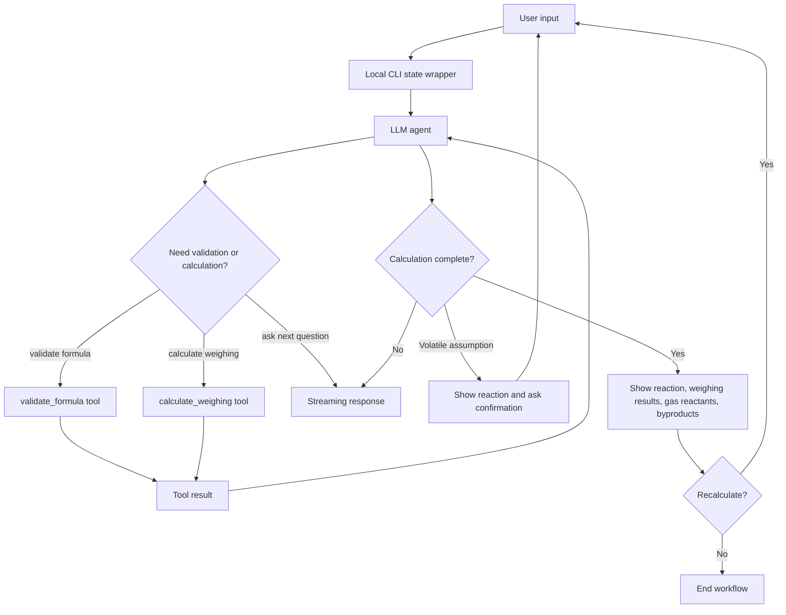

# weigh-calc

無機材料の秤量計算を行う CLI AI エージェントです。LLM が対話とワークフロー進行を担当し、化学式検証、反応式の元素収支、秤量値計算は Rust の tool で決定的に実行します。

## Features

- 目的組成と目標質量から原料の秤量値を計算
- 小数、分数、括弧付き化学式に対応
- O2 などのガス原料は元素収支に含めつつ、秤量対象外として表示
- 曖昧な材料名や略称は候補化学式を提示して確認
- LLM が提案した揮発副生成物を含めて反応式をバランス
- 反応式は必ず表示
- 揮発を含む場合は、反応式を表示してユーザー確認後に秤量値を表示
- Streaming 応答、thinking token 非表示、thinking 中は `Thinking...` を表示
- 対応モデルでは Ollama thinking を有効化し、非対応モデルでは起動時に注意を表示
- 左右移動、Backspace/Delete、日本語入力、上下履歴つき CLI 入力
- 結果は Markdown 強調なしのプレーンテキストで表示

## Requirements

- Rust
- Ollama
- 対応モデル: 既定は `qwen3.6:35b`

## Run

```bash
cargo run
```

モデル、Ollama URL、Ollama context size は環境変数で変更できます。

| 環境変数 | 既定値 | 説明 |
| --- | --- | --- |
| `OLLAMA_BASE_URL` | `http://localhost:11434` | 接続先の Ollama URL |
| `OLLAMA_MODEL` | `qwen3.6:35b` | 使用する Ollama model |
| `OLLAMA_NUM_CTX` | `128000` | Ollama に渡す context size (`num_ctx`) |

```bash
OLLAMA_BASE_URL=http://localhost:11434 OLLAMA_MODEL=qwen3.6:35b OLLAMA_NUM_CTX=128000 cargo run
```

thinking は `qwen3`, `deepseek-r1`, `deepseek-v3.1`, `gpt-oss` などの対応モデルでは自動で有効化します。Gemma 4 系は Ollama の `think` API ではなく prompt token で有効化します。

CLI の終了と画面操作:

- `Ctrl+C`: 終了
- `/quit`, `/exit`: 終了
- `/clear`: 画面クリア

## Agentic Loop

この CLI は、LLM が対話状態と次の質問を制御し、化学式検証と秤量計算は Rust tool が決定的に実行する agentic loop を採用しています。



## Example

小数組成と揮発副生成物を含む例:

```text
目的組成: Li1.3Al0.3Ti1.7(PO4)3
目標質量: 1 g
原料: Li2CO3, Al2O3, TiO2, NH4H2PO4
```

反応式例:

```text
0.65 Li2CO3 + 0.15 Al2O3 + 1.7 TiO2 + 3 NH4H2PO4 -> Li1.3Al0.3Ti1.7(PO4)3 + 0.65 CO2 + 3 NH3 + 4.5 H2O
```

分数組成も入力できます。

```text
LiNi1/3Co1/3Mn1/3O2
```

曖昧な材料名や略称は、候補を提示して確認します。

```text
LFP -> LiFePO4
NMC111 -> LiNi1/3Co1/3Mn1/3O2
LATP -> Li1.3Al0.3Ti1.7(PO4)3
LGPS -> Li10GeP2S12
```

出力例:

```text
反応式: 2.5 Li2S + 0.5 P2S5 + LiCl -> Li6PS5Cl
計算が完了しました。

Li2S: 4.2796 g (4279.6 mg, 0.09316 mol)
P2S5: 4.1408 g (4140.8 mg, 0.01863 mol)
LiCl: 1.5796 g (1579.6 mg, 0.03726 mol)

再度計算しますか？
```

## Release

GitHub Actions は `v*` tag push で動作します。タグ対象のコミットが `main` に含まれていることを確認してから、ビルド artifact と GitHub Release asset を作成します。

- tag push (`v*`): Windows x86_64 と macOS Apple Silicon のビルド検証、artifact 作成、GitHub Release asset 添付

Release artifacts:

- `weigh-calc-x86_64-pc-windows-msvc.zip`
- `weigh-calc-aarch64-apple-darwin.tar.gz`

Tag release example:

```bash
git tag v0.1.0
git push origin v0.1.0
```

## License

MIT ks250206 2026
